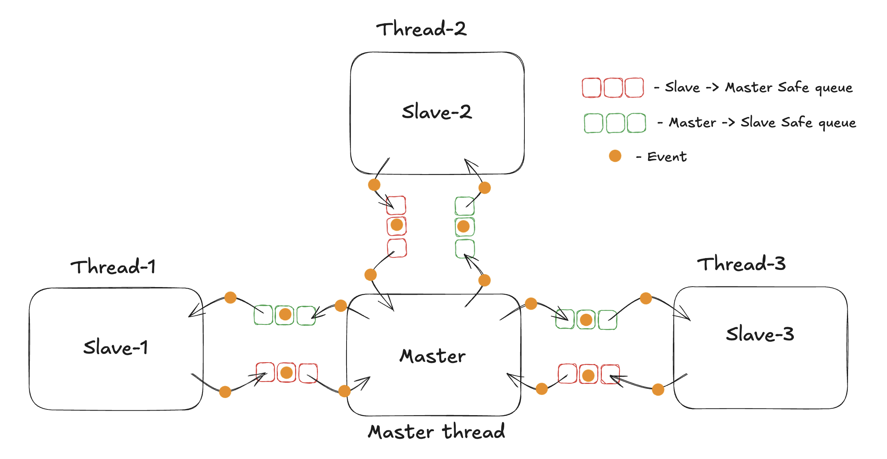
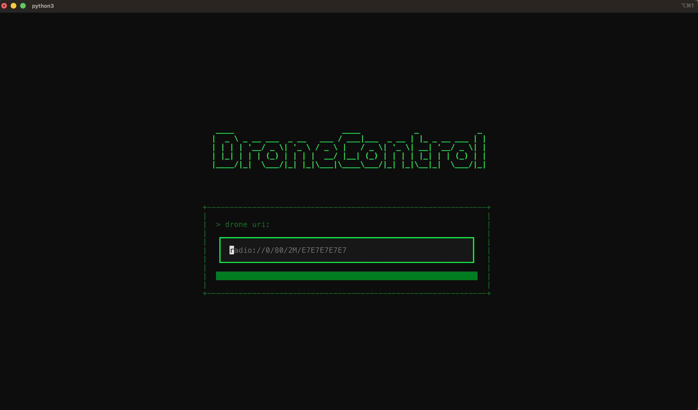
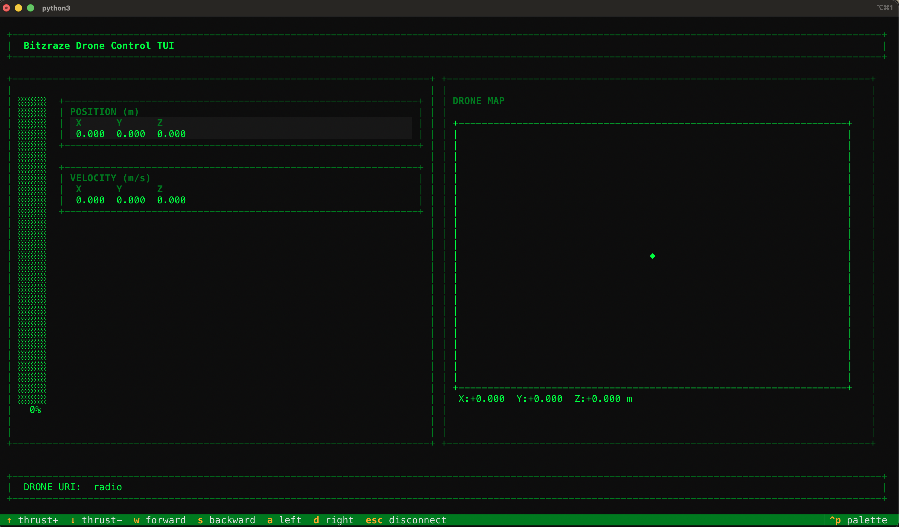

# Drone controller for bitcraze drones
---

### Comunication architecture
---
Communication architecture is based on master-slave approach, where master 
is a single thread that manages events that comes from different slaves.

Visualization:



### Pre-launch
Prepare python venv to install all necessary packages.
Documentation for uv package manager: https://docs.astral.sh/uv/
```
uv sync
```

#### Options (in progress)
* Launch with keyboard
```
uv run run.py --uri "drone_uri" --keyboard
uv run run.py --uri "drone_uri" -k
```

* Launch with GUI
```
uv run run.py --uri "drone_uri" --gui
uv run run.py --uri "drone_uri" -g
```

* Launch with TUI
```
uv run run.py --tui
uv run run.py -t
```

### DroneControlTUI - Terminal User Interface for Controlling Bitcraze drones
---

Visualization:



